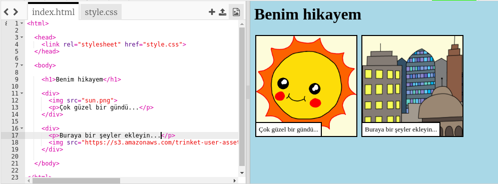

## Kendi resimlerinizi bulma

Hikayenize eklemek için web'de bir resim bulalım.

+ Bu sayfaya [gidin](http://jumpto.cc/html-images){: target = "_ blank"} ve hikayenize eklemek istediğiniz bir resim bulun.

+ Görüntüye sağ tıklayın ve **Görüntü URL'sini Kopyala** (veya kullandığınız bilgisayara bağlı olarak **Görüntü Adresi**Kopyala) tıklayın. URL, görüntünün adresidir.

+ `index.html` sayfanıza dönün.

+ URL'yi `` etiketinizdeki konuşma işaretlerinin arasına yapıştırın. Resminizin göründüğünü görmelisiniz!

