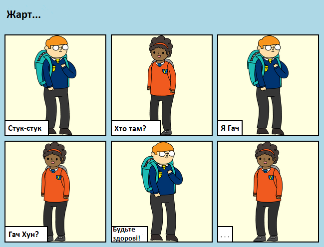

## Вступ

У цьому проекті ви дізнаєтесь як створити власну веб-сторінку, щоб розповісти історію, анекдот чи поему.

### Що ви будете робити

Прогортайте вниз у Трінкет, щоб побачити кінець історії!

  <iframe src="https://trinket.io/embed/html/202fcd5e68?outputOnly=true&start=result" width="600" height="450" frameborder="0" marginwidth="0" marginheight="0" allowfullscreen>
  </iframe>
  

### Що ви дізнаєтесь

Цей проект охоплює елементи з наступних напрямів навчального плану [Raspberry Pi Digital Making Curriculum](https://rpf.io/curriculum){:target="_blank"}:

+ [Розробка основних 2D та 3D активів](https://www.raspberrypi.org/curriculum/design/creator){:target="_blank"}.

### Додаткова інформація для вчителів

Якщо вам потрібно роздрукувати цей проект, будь ласка скористайтеся [версією для друку](https://projects.raspberrypi.org/uk-UA/projects/tell-a-story/print){:target="_blank"}.

Скористайтеся посиланням у нижньому колонтитулі, щоб отримати доступ до сховища GitHub для цього проекту, який містить усі ресурси (включаючи приклад готового проекту) в папці uk-UA/resources.