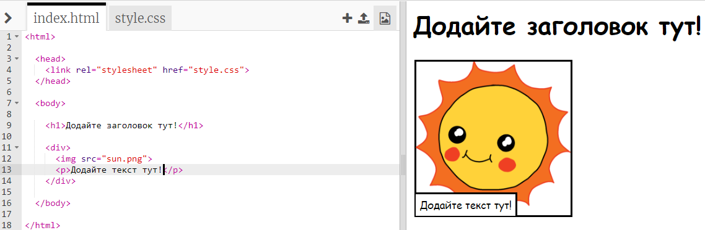
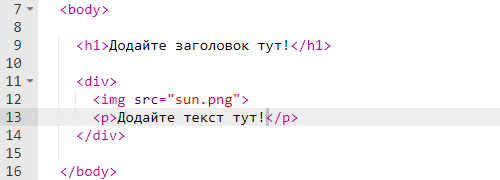
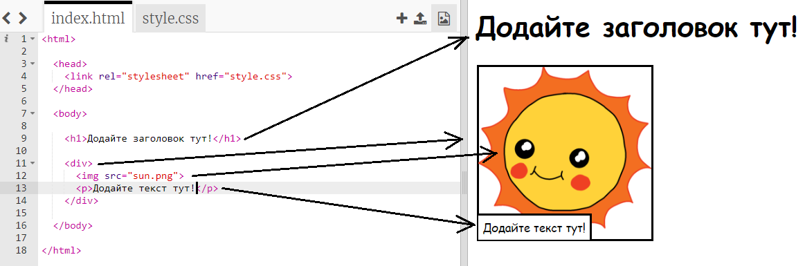

## Редагування історії

Розпочнемо із редагування HTML та CSS вмісту історії на веб-сторінці.

+ Відкрийте [цей трінкет](http://jumpto.cc/web-story){:target="_blank"}.

Проект повинен виглядати так:

Вміст веб-сторінки знаходиться в `<body>`розділі `index.html` документу HTML.

+ Вміст веб-сторінки можна знайти у 7 рядку всередині кодів `<body>` і `</body>`.

+ Переконайтеся, що знаєте, які теги використовуються для створення різних частин веб-сторінки.

## \--- collapse \---

## title: Відповідь

+ `<h1>` - це **заголовок**. Щоб створити заголовки різної довжини, використовуйте числа від 1 до 6.
+ `
` - це **розділ**. Цей код допомагає об'єднати все докупи. На цій веб-сторінці він використовується, щоб об'єднати елементи кожної частини історії.
+ `` - це **зобаження**.
+ `
` - це **абзац** тексту.

\--- /collapse \---