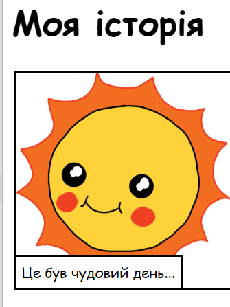

\--- challenge \---

## Завдання: внесіть зміни

Відредагуйте коди HTML і CSS, щоб налаштувати веб-сторінку.

Вміст HTML можна знайти в файлі `index.html`, а CSS в файлі `style.css`.

Також можна змінювати кольори веб-сторінки і використовувати різні шрифти, зокрема:

+ Arial
+ Comic Sans MS
+ Impact
+ Tahoma

Більше назв кольорів CSS [тут](http://jumpto.cc/colours){:target="_blank"}.

\--- /challenge \---