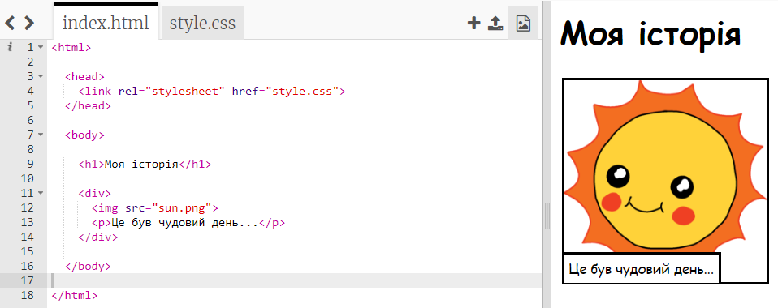
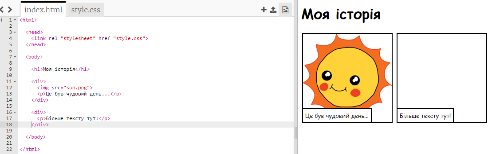
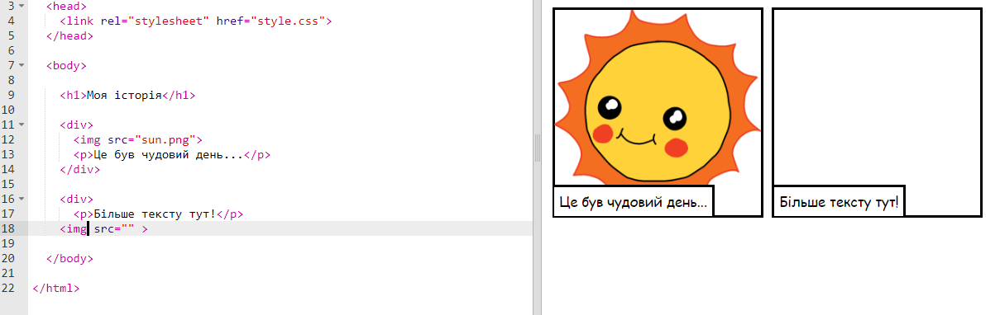
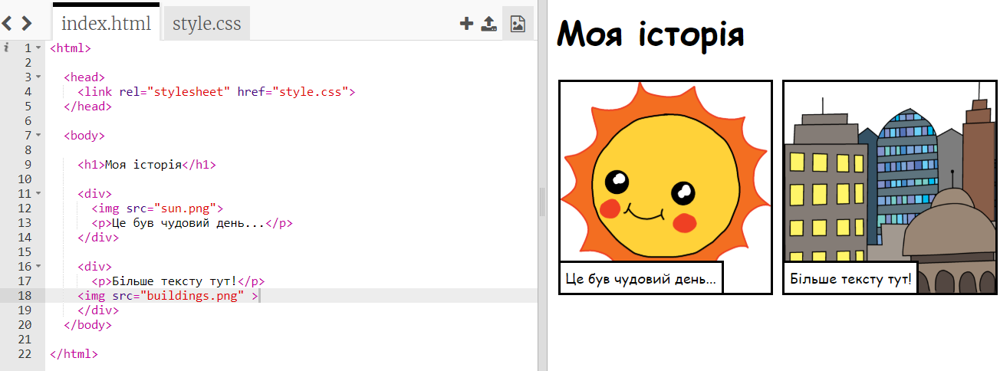

## Розкажіть історію

Додамо другу частину історії.

+ У 15 рядку коду додайте ще раз початковий `<div>` і кінцевий `</div>` теги.



+ Додайте абзац тексту у новий тег `<div>`:

```html
<p>Більше тексту тут!</p>
```



+ Показати зображення у новому прямокутнику можна, додавши цей код у тег `<div>`:

```html

```



Зверніть увагу, що теги `` трохи відрізняються від інших: у них немає кінцевого тегу.

+ Щоб з'являлось зображення, потрібно додати до нього **джерело** (`src`) у лапках.

Натисніть на значок "зображення", щоб побачити усі зображення, доступні для вашої історії.


+ Оберіть, яке зображення ви хочете додати, і запам’ятайте його назву, наприклад `buildings.png`.

+ Щоб повернутися до коду, натисніть `index.html`.


+ Назву зображення напишіть у лапках всередині тегу ``.

```html

```

