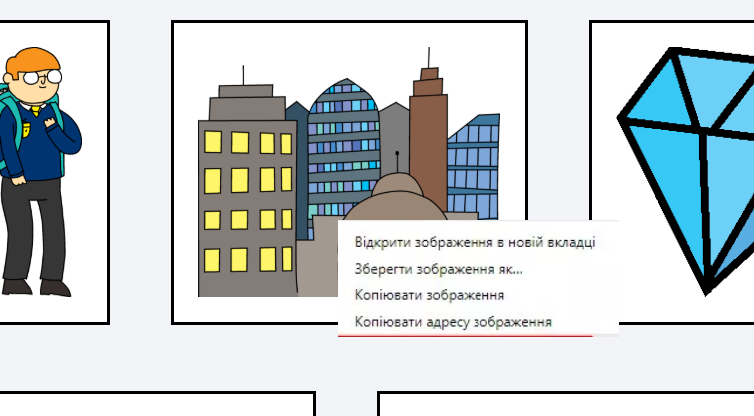
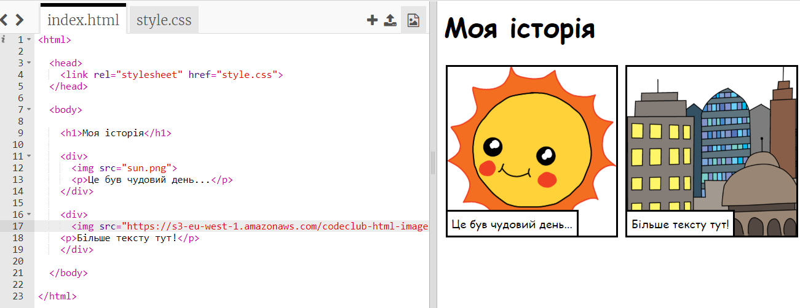

## Пошук власних зображень

Знайдемо в Інтернеті зображення, яке можна додати до вашої історії.

+ Перейдіть на [цю сторінку](http://jumpto.cc/html-images){:target="_blank"} і знайдіть зображення, яке хочете додати до історії.

+ Натисніть правою кнопкою миші на зображення та виберіть **Копіювати URL-адресу зображення** (або **Копіювати адресу зображення**, залежно від комп'ютера, який ви використовуєте). URL-адреса - це адреса зображення.

+ Поверніться на сторінку `index.html`.

+ Вставте URL-адресу у лапках у тег ``. Має з'явитись ваше зображення!

