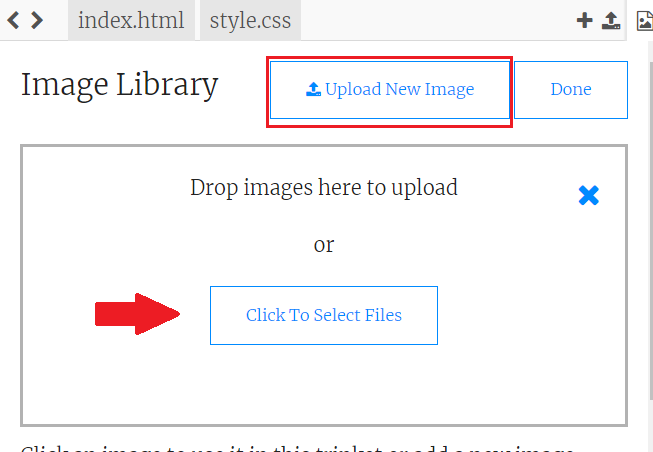

## Завантаження зображень

**Якщо ви маєте акаунт у Трінкет**, ви також можете завантажити зображення на вашу веб-сторінку.

+ Натисніть на значок зображення вгорі трінкету, оберіть **Додати зображення**.


+ Натисніть на кнопку **Завантажити**, знайдіть на комп'ютері зображення, яке хочете використати і перетягніть його в бокс або скористайтеся кнопкою "Обрати зображення".



+ Додайте назву нового зображення в лапках в тег ``:

```html

```