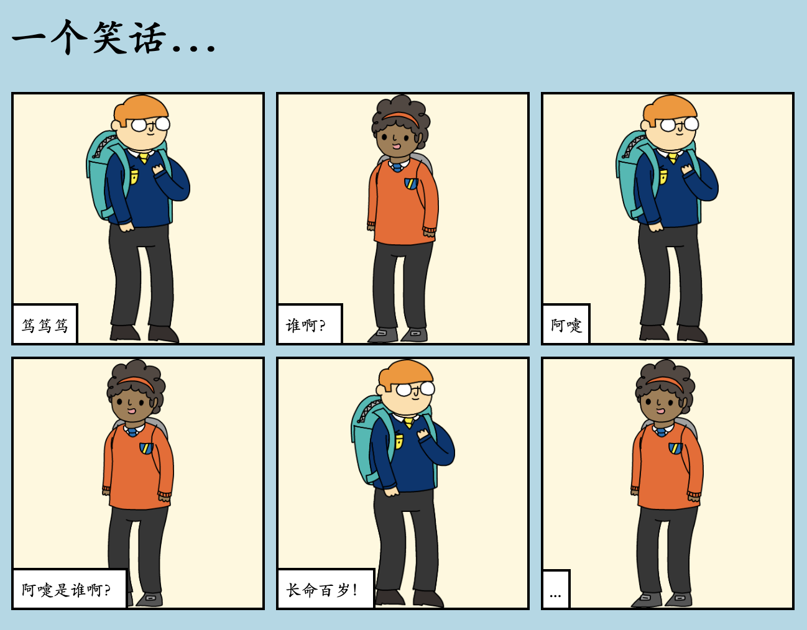

## 介绍

在这个项目中，你将学习如何创建自己的网页来讲述故事、笑话或诗歌。

### 你将做什么

在trinket中向下滚动查看笑话的笑点！

  <iframe src="https://trinket.io/embed/html/c8afdef912?outputOnly=true&start=result" width="600" height="450" frameborder="0" marginwidth="0" marginheight="0" allowfullscreen>
  </iframe>
  

### 你将学到什么

This project covers elements from the following strands of the [Raspberry Pi Digital Making Curriculum](https://rpf.io/curriculum){:target="_blank"}:

+ [设计基本的2D和3D资源](https://www.raspberrypi.org/curriculum/design/creator)。

### 教师参考信息

如果您需要打印此项目，请使用[适合打印的版本](https://projects.raspberrypi.org/en/projects/tell-a-story/print){:target="_blank"} .

使用页脚中的链接访问此项目的 GitHub 存储库。 包括'zh/resources'文件夹中的所有资源 (包括一个已完成的示例项目)。