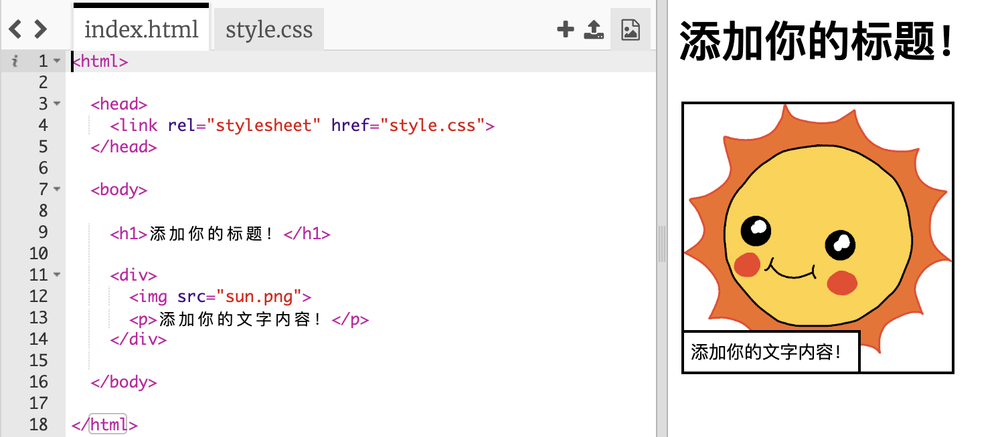
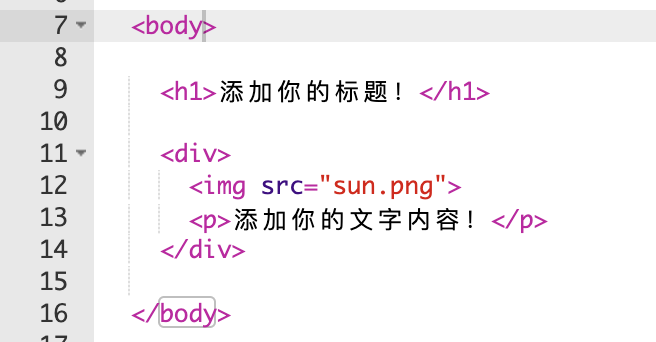
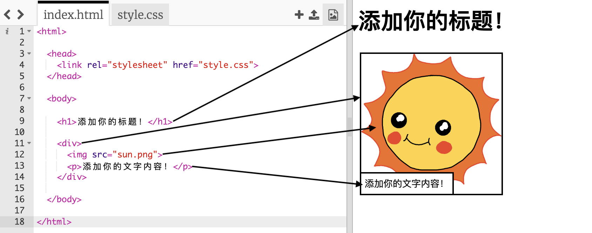

## 编辑你的故事

让我们首先开始编辑故事网页的HTML内容和CSS样式。

+ 打开 [这个trinket](http://jumpto.cc/web-story){:target="_blank"}.

这个项目应该是这样的：

网页内容位于HTML文件`index.html的<code><body>`部分中</code>。

+ 从第7行起找到位于`<body>`和`</body>`标签之间的网页内容。

+ 看看您是否可以找到哪些标签用于创建网页的哪些部分。

## \--- collapse \---

## title: 答案

+ `<h1>` is a **heading**. You can use the numbers 1 to 6 to create headings of different sizes.
+ `
` is short for **division**, and is a way of grouping stuff together. In this webpage, you'll use it to group together all the stuff for each part of your story.
+ `` is an **image**.
+ `
` is a **paragraph** of text.

\--- /collapse \---