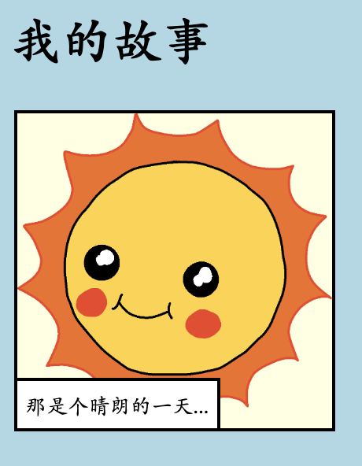

--- challenge ---

## 挑战：做一些修改

编辑HTML和CSS代码来个性化您的网页。

HTML的内容可以在`index.html`文件中找到，而CSS样式在`style.css`文件中。

您还可以更改网页中使用的颜色，并且可以使用不同的字体，例如：

+ Arial
+ Comic Sans MS
+ Impact
+ Tahoma

更多的CSS颜色名称可以在[这里](http://jumpto.cc/colours){:target="_blank"}找到。

--- /challenge ---