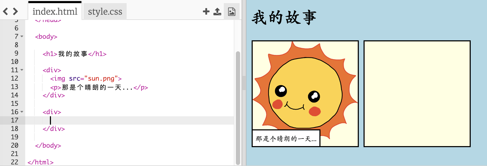
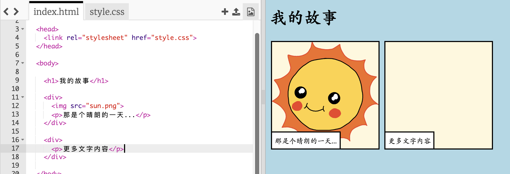
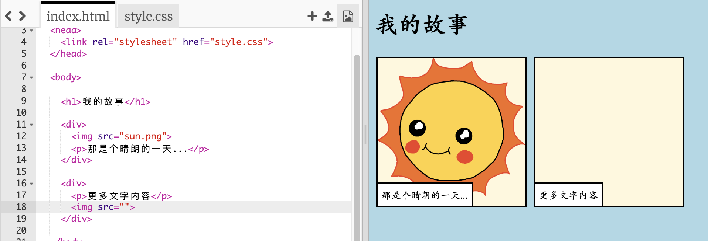
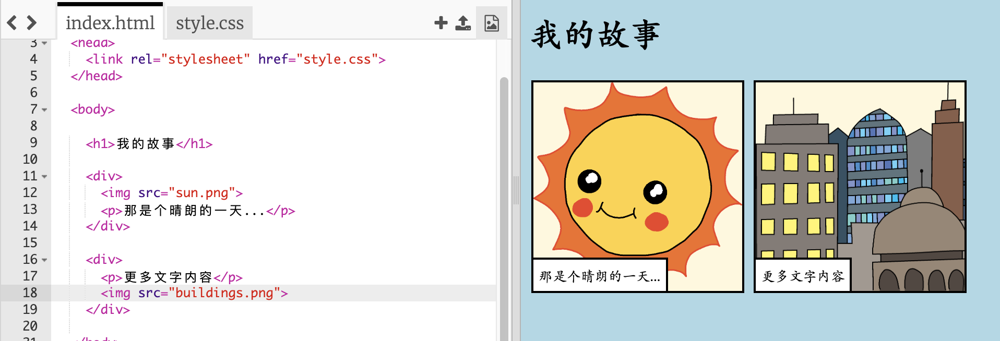

## 讲述你的故事

让我们在你的故事中添加第二部分。

+ 转到代码的第15行，然后添加另一组`<div>`和`</div>`开始和结束标签。 这将为你的故事的下一部分创建一个新的框。



+ 在新的`<div>`标签之中添加一段文字：

```html
<p>添加更多文字！</p>
```



+ 你可以通过在你的`<div>`标签之间添加此代码而在你的新的故事框中显示图片：

```html

```



注意``标签与其他标签有一点不同：它们没有结束标签。

+ 为了能够显示图片，你需要将图片的 **源文件名** (`src`) 加入双引号之间.

点击图标查看你的故事中可用的图片。


+ 确定要添加的图片并记住其文件名，例如` buildings.png ` 。

+ 点击`index.html`来返回到你的代码。


+ 在``标签的双引号之间加入图片的文件名。

```html

```

