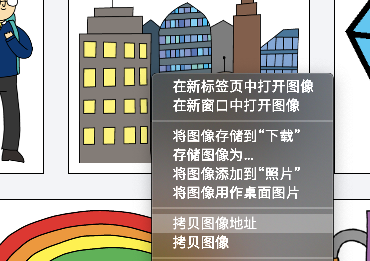
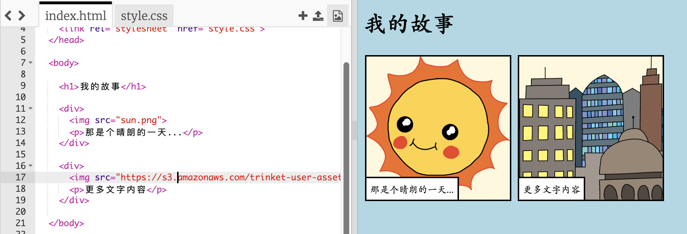

## 寻找你自己的图片

让我们在网络上找一张图片来添加到您的故事中。

+ 转到[此页面](http://jumpto.cc/html-images){:target="_blank"}，并找到您想要加入到你的故事中的图片。

+ 右键点击图片，然后点击**拷贝图像URL** (或**拷贝图像地址**，这依照您使用的浏览器而有所不同)。 URL 是图片的网络地址。

+ 返回到您的 `index.html` 页面。

+ 将URL粘贴到``标签中的双引号之间。您应该看到图片会显示出来！

