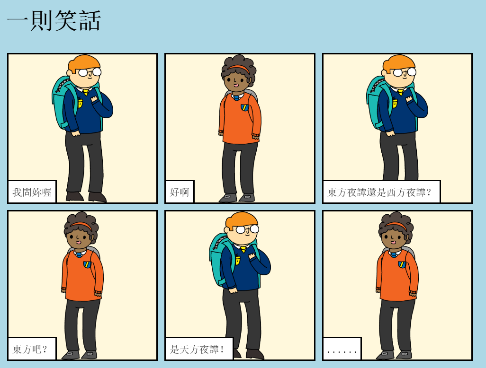

## 介紹

你將在本專案中會學到如何建立自己的網頁來講述一個故事、笑話或一首詩。

### 你的成品會是

滾動 trinket 檢視笑話！

  <iframe src="https://trinket.io/embed/html/c8afdef912?outputOnly=true&start=result" width="600" height="450" frameborder="0" marginwidth="0" marginheight="0" allowfullscreen>
  </iframe>
  

### 你會學到

This project covers elements from the following strands of the [Raspberry Pi Digital Making Curriculum](https://rpf.io/curriculum){:target="_blank"}:

+ [設計基本的 2D 和 3D 物件](https://www.raspberrypi.org/curriculum/design/creator) {:target="_blank"}。

### 教學補充資訊

如果需要列印本專案，請使用[友善列印](https://projects.raspberrypi.org/en/projects/tell-a-story/print) {:target="_blank"} .

頁尾鏈接至本專案的 GitHub 資源庫，“en/resources” 資料夾中包含所有資源（包括完成的範例專案）。