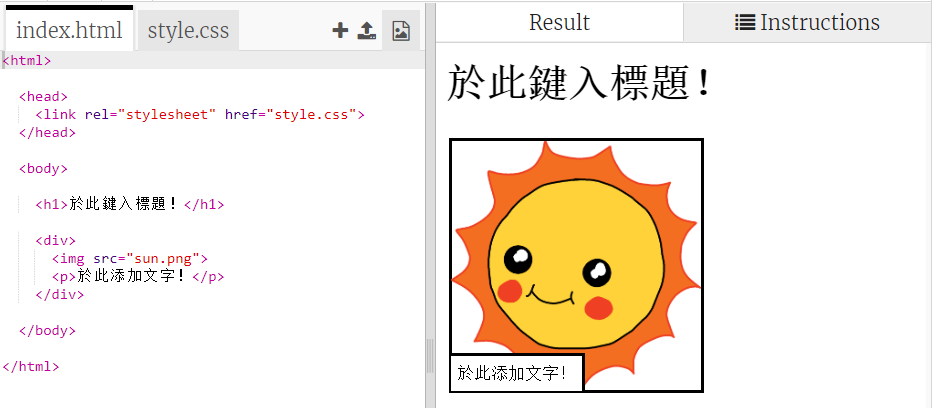
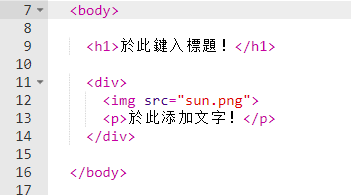
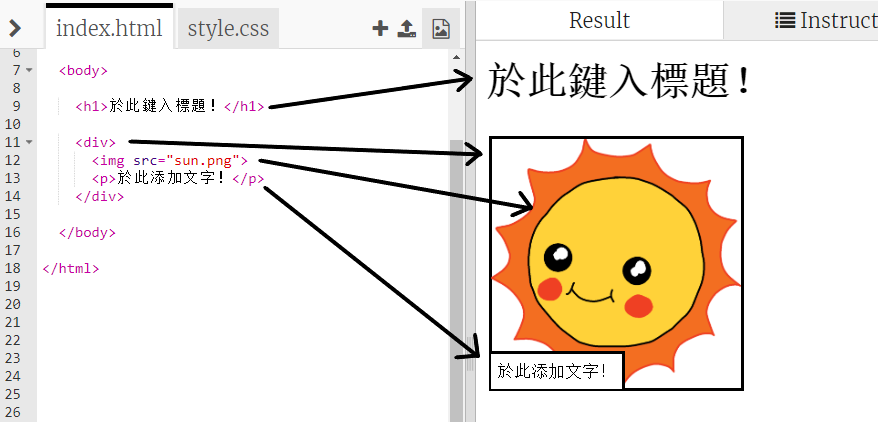

## 編輯你的故事

讓我們從故事網頁的 HTML 內容和 CSS 樣式開始編輯。

+ Open [this trinket](http://jumpto.cc/web-story){:target="_blank"}.

The project should look like this:

網頁內容位於 HTML 文檔 `index.html` 中 `<body>`的部分。

+ 找到第 7 行 `<body>` 與 `</body>` 標籤之間的網頁內容。

+ 看你能否找出網頁建立各個部分的不同標籤，彼此的對應關係。

## \--- collapse \---

## title: 答案

+ `<h1>` 指的是**標題**，可以使用數字1到6建立不同的標題。
+ `
`為** division 區塊**的縮寫，分組的一種方式。在這個網頁中，你會將它用以組合故事裡的每個部分。
+ `` 是**圖片**。
+ `
`是**段落**文字。

\--- /collapse \---