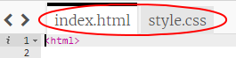

--- challenge ---

## 挑戰：做些變化

編輯 HTML 和 CSS 代碼客製自己的網頁。

HTML 內容可以在 `index.html` 文件中找到，CSS樣式則是在 `style.css` 文件。

您還可以修改網頁中使用的顏色，還能使用不同的字體，例如：

+ Arial
+ Comic Sans MS
+ Impact
+ Tahoma

你可以在[這裡](http://jumpto.cc/colours){:target="_blank"}找到更多 CSS 樣式的代碼 。

--- /challenge ---