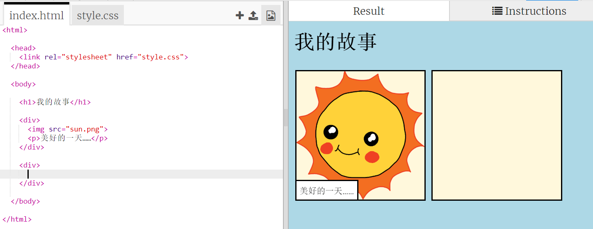
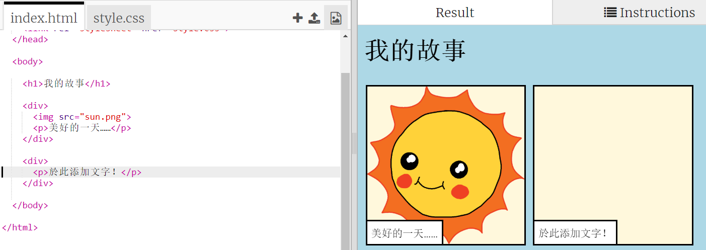
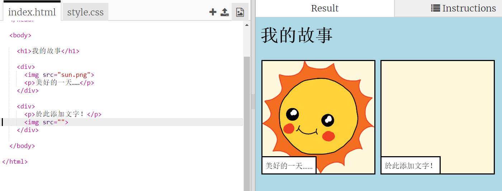
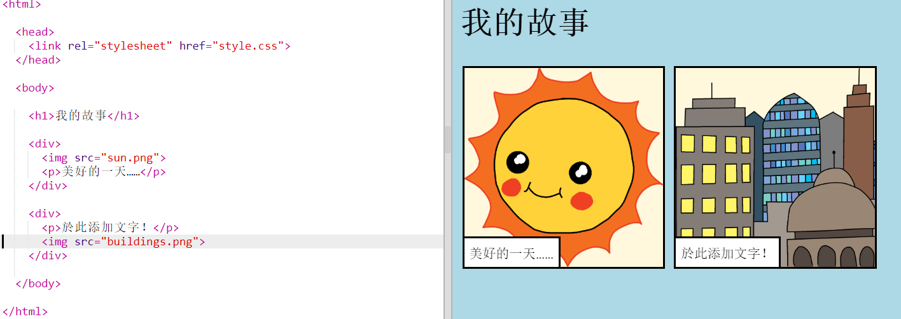

## 敘述你的故事

讓我們在故事中添加第二部分。

+ 轉到代碼的第15行，加入另一組 `<div>` 和 `</div>` 開始和結束標記。這將為您故事的下一部分建立一個新框架。



+ 在新的 `<div>` 標記內添加一段文字：

```html
<p>更多文字在這裡！</p>
```



+ 您可以在 `<div>` 標記內加入此代碼，在新框中顯示圖像：

```html

```



請注意，``標籤與其他標籤有點不同：它們沒有結束標籤。

+ 要顯示圖像，需要在語音標記內添加圖像的 **源** （`src`）。

單擊圖像圖標以查看可用於您的故事的圖像。


+ 確定要添加的圖像並記住其名稱，例如 `buildings.png`。

+ 單擊 `index.html` 以返回到您的代碼。


+ 在 `` 標記中的雙引號語音標記之間添加圖像名稱。

```html

```

