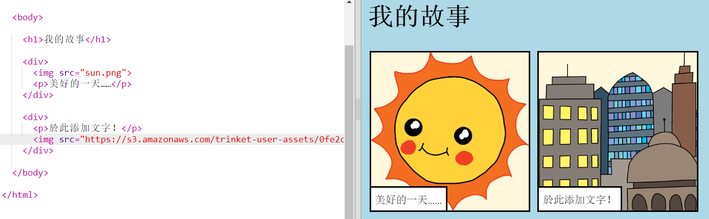

## 找到你想要的圖片

讓我們在網絡上找到一張圖來加到你的故事中。

+ 轉到[此頁面](http://jumpto.cc/html-images) {：target =“ _ blank”}，然後找到要包含在故事中的圖像。

+ 右鍵單擊該圖像，然後單擊 **複製圖像URL** (或 **複製圖像地址**，選項會依據每人作業平台而有不同)。 URL是圖像的地址。

+ 返回 `index.html` 頁面。

+ 將URL貼上在 `` 標記中的雙引號語音標記之間。你的圖像就會出現了！

